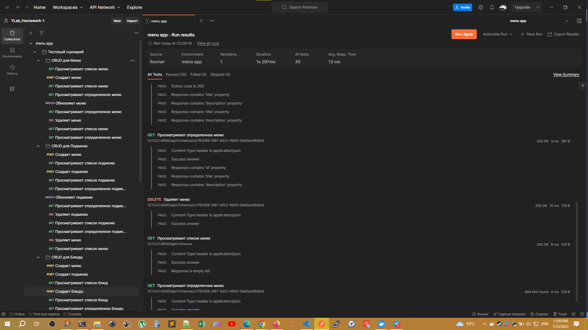

# REST API ресторана

<h3 align="left">Технологии:</h3>
<div align="center">
  
  
  
  
  
  
  
  
  
  
  
  
  
  
  
  
  
  
  
</div>

## Разделы
- [Технические задания](#технические-задания)
- [Описание API](#описание-api)
    - [Файл администратора](#excel-файл-администратора)
    - [Запуск приложения в контейнерах](#запуск-приложения-в-контейнерах)
        - [Запуск тестов](#запуск-тестов-и-баз-данных-для-тестирования-с-помощью-docker-compose)
    - [Кэширование Redis](#кэширование)
    - [Паттерны Репозиторий и Сервисный слой](#паттерны)
    - [Тестирование](#тестирование)
        - [Структура БД для тестирования](#структура-бд-используемая-для-тестирования)
- [Pre-commit hooks](#pre-commit-checks)
- [Запуск приложения вручную (не актуально)](#запуск-приложения-вручную-не-актуально)
- [Результаты тестирования Postman](#резльтаты-тестирования-postman)

<br>
<br>

## Технические задания
1. <a href="assignment/Homework_1.md"> <b>Требования к разрабатываемому API ресторана</b> </a>

2. <a href="assignment/Homework_2.md"> <b>Требования к интеграционному тестировнию API ресторана</b> </a>

3. <a href="assignment/Homework_3.md"> <b>Разграничение бизнес логики с помощью паттернов (например, MVC, Репозиторий, Сервисный слой и др.). Кэширование на Redis. Аннотации типов и проверка с помощью pre-commit hooks</b> </a>

4. <a href="assignment/Homework_4.md"> <b>Асинхронная работа и бэкграунд таски с помощью BackgroundTasks и Celery, синхронизация с excel файлом</b> </a>
<br>

## Описание API
CRUD REST API ресторана, содержащий следующие сущности:
- Меню/ Menue
- Подменю/ Submenu
- Блюдо/ Dish

Реализована возможность создавать, читать, обновлять и удалять эти сущности. Добавлен эндпоинт `http://localhost:8000/getall/`, позволяющий получить одним запросом все меню, связанные соответственно подменю и блюда в виде JSON-"матрешки". Предусмотрено кэширование с точечной инвалидацией. Инвалидация происходит через BackgroundTasks. Приложение и все СУБД контейнеризированы. Запуск с помощью команды `docker-compose up -d`. **API, базы данных и тесты полностью асинхронные.**
Файл [.env.example](/.env.example) используется для хранения переменных окружения, необходимых для подключения к БД внутри Docker контейнера. *Убрал из .gitignore упоминание `.env` из соображений удобства проверки преподавателем.*

## Excel файл администратора
Для комфортного использования приложения разработана система односторонней синхронизации Excel файла [Menu.xlsx](admin/Menu.xlsx) в папке [/admin](/admin) с базой данных по API каждые 15 секунд в рамках фоновой задачи, запускаемой в Celery.

>**Warning**
>**Файл [Menu.xlsx](admin/Menu.xlsx) доступен контейнеру напрямую через [Bind mount](https://docs.docker.com/storage/bind-mounts/) и поэтому также доступен администратору для редактироваиня через операционную систему пользовательского компьютера.**

<div align='center'>

</div>

Изменения, которые необходимо отразить в БД, учитываются относительно файла `.previous_state_menu.xlsx`, который хранится непосредственнов в Volume контейнера Celery и не виден пользователю из ОС. После внесения изменений в БД в этот файл сохраняется состояние Excel файла, после чего он используется для сравнения с оригинальным файлом, а все изменения будут внесены с помощью асинхронных зазпросов к API с помощью библиотеки [aiohttp](https://docs.aiohttp.org/en/stable/client_quickstart.html). Парсинг Excel файла осуществляется с помощью библиотеки [Pandas](https://pandas.pydata.org/). **Резонное ограничение на уникальность (ID) ключей экземпляров сущностей в базе данных требует, чтобы ID в Excel таблице тоже были уникальными в рамках одной сущности (!)**. Для первоначального заполнения таблицы и последующего добавления элементов был доработан существующий POST эндпоинт: добавленна поддержка [Query String](https://en.wikipedia.org/wiki/Query_string) с опциональным параметрмо **id** (например `POST http://127.0.0.1:8000/menus/?id=123`), что позволяет пользовтелю Excel таблицы задаваться собственными ID. В случае, если параметр не будет передан в URL, то в качестве первичного ключа будет сгенерирован UUID.


## Запуск приложения в контейнерах

|      |   Образы для Docker      |
|------|--------------------------|
|API   | python:3.10-slim         |
|DB    | postgres:15.1-alpine     |
|Cache | redis/redis-stack:latest |
|Celery| python:3.10-slim         |
|Broker| RabbitMQ                 |


```
docker-compose up -d
```
API будет доступен по следующему URL: http://127.0.0.1:8000/api/v1/
Тесты на Postman можно запустить если очистить Excel таблицу администратора и подождать 15 секунд, чтобы база пришла в соответствие.
<br><br>

## Запуск тестов и баз данных для тестирования с помощью Docker-compose
```
docker-compose -f docker-compose-tests.yml up
```
Результаты тестирования будут выведены в терминал.
Добавлен 34-ый тест на эндпоинт, возвращающий все сущности: `http://localhost:8000/api/v1/getall/`.
<br><br>


## Кэширование
Для хранения кэша использована NoSQL база данных [Redis](https://redis.io/).

**_Реализована точечная инвалидация кэша._
В качестве ключей в Reids используется URL ресусрса, с помощью фильтрации по которому происходит точечная инвалидация всех зависимых объектов в кэшэ.** *Время хранения каждой записи в кэшэ принято 60 секунд.*


## Паттерны


В проекте реализованы паттерны Репозиторий и Сервисный слой, что позволяет полностью передать работу с базами данных (SQL-ORM и NoSQL) соотвутствующим [репозиториям](app/repositories/), а всю подготовку данных к передаче в функции эндпоинтов берет на себя [Сервисный слой](app/services/).


## Тестирование

Для интеграционного тестирования работы API использована библиотека [Pytest](https://docs.pytest.org/).

Реализованы 34 **асинхронных** CRUD теста для всех эндпоинтов. Проверка Read, Update, Delete методов реализована с помощью фикстур, расположенных в файле [conftest.py](tests/conftest.py), которые создают модели тестируемых ресурсов напрямую в тестовой БД.

Реализован [тестовый сценарий](tests/test_quantity.py), проверяющий правильность подсчета:
- количества подменю и блюд относящихся к определенному основному меню;
- количества блюд относящихся к определенному подменю.

## Структура БД, используемая для тестирования
```
Restaurant
├── Menu 1
│   ├── Submenu 1
│   │   ├── Dish 1
│   │   └── Dish 2
│   └── Submenu 2
│       └── Dish 3
├── Menu 2
│   └── Submenu 3
└── Menu 3
```
[link to this ASCII Tree generator](https://tree.nathanfriend.io/?s=(%27options!(%27fancy!true~fullPath5~trailingSlash5~rootDot5)~6(%276%27Restaurant-M41.10102.203-M42.3-%27)~version!%271%27)*%20%20-%5Cn*.-*Subm40-**Dish%204enu%205!false6source!%016540.-*)
<br>БД заполняется фикстурами и проверяется правильность значений, передаваемых в полях `submenu_count` и `dish_count` в JSON-ответах на GET запросы к различным меню и подменю. <br> <br>


### Pre-commit checks
В проекте везде использовались тайпхинты с последующей проверкой [MyPy](https://github.com/python/mypy).
Полный список всех чеков представлен ниже:


<br>
<br>
<br>
<br>
<br>


> ## Запуск приложения вручную (не актуально)

> Для разработки использовался Python3.11

> 1. Рекомендуется развернуть виртуальное окружение и установить в него все зависимости.

> ```console
> python3 -m venv venv
> source venv/bin/activate # на Linux
> pip install -r requirements.txt
> ```

> 2. В файле переменных окружения [.env](/.env.example) убедится, что в качестве хостов баз данных укзан localhost
> исправить на localhost
> ```
> DATABASE_HOSTNAME=127.0.0.1
> REDIS_HOST=127.0.0.1
> ```

> 3. Установить Docker самостоятельно. Затем требуется скачать образы Postgres:Alpine и redis-stack:latest, а затем запустить контейнер. Это можно сделать с помощью следущих Docker команд.
> ```console
> docker run --name pg-restaurant -p 5432:5432 -e POSTGRES_PASSWORD=password -e POSTGRES_DB=data -e TZ=Europe/Moscow --restart=always -d postgres:15.1-alpine;
> docker start pg-restaurant;
> docker run -p 6379:6379 -it redis/redis-stack:latest
> ```
> Порт контейнера Postgres 5432 прокидывается на порт машины 5432.
> Порт контейнера с Redis 6379 прокоидвается на 6379.

> 4. Для запуска приложения рекомендуется использовать ASGI веб сервер [uvicorn](https://www.uvicorn.org/).
> ```console
> uvicorn app.main:app
> ```
> <br>

## Результаты тестирования Postman

