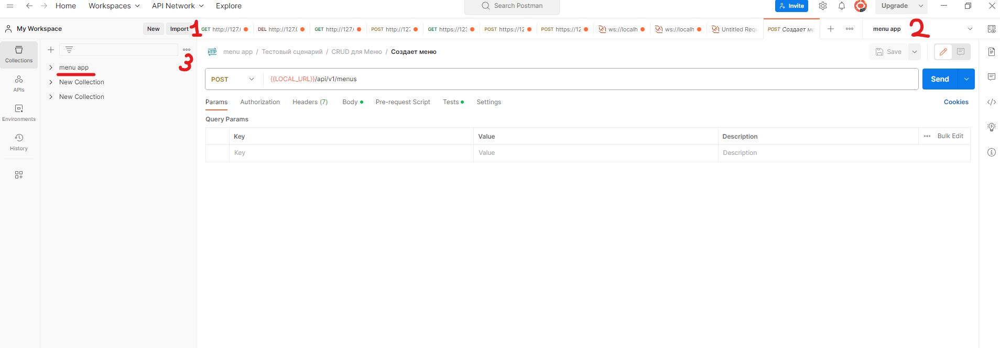

### Написать проект на FastAPI с использованием PostgreSQL в качестве БД. В проекте следует реализовать REST API по работе с меню ресторана, все CRUD операции. Для проверки задания, к презентаций будет приложена Postman коллекция с тестами. Задание выполнено, если все тесты проходят успешно.

Даны 3 сущности: Меню, Подменю, Блюдо.

Зависимости:
- У меню есть подменю, которые к ней привязаны.
- У подменю есть блюда.

Условия:
- Блюдо не может быть привязано напрямую к меню, минуя подменю.
- Блюдо не может находиться в 2-х подменю одновременно.
- Подменю не может находиться в 2-х меню одновременно.
- Если удалить меню, должны удалиться все подменю и блюда этого меню.
- Если удалить подменю, должны удалиться все блюда этого подменю.
- Цены блюд выводить с округлением до 2 знаков после запятой.
- Во время выдачи списка меню, для каждого меню добавлять кол-во подменю и блюд в этом меню.
- Во время выдачи списка подменю, для каждого подменю добавлять кол-во блюд в этом подменю.
- Во время запуска тестового сценария БД должна быть пуста.

### Инструкция по работе с постман:
Нажимаем import (1 на скрине) и переносим 2 прикрепленных выше файла в окно постман. Один файл - коллекция тестов, второй - переменные окружения. В диалоговом окне подтверждаем импорт. После этого должна появиться коллекция (подчернута на скрине) menu app.
Выбираем переменные окружения (2 на скрине) из выпадающего списка
После этого можем зайти в коллекцию menu app и запустить каждый тест вручную. Для этого открываем коллекцию menu app, выбираем Тестовый сценарий -> CRUD для меню -> Просматривает список меню(или любой другой) у нас в центральной части появляется запрос, нажимаем Send и запрос летит в наше приложение.
Если хотим запустит сразу всю коллекцию тестов, то жмем на три точки (3 на скрине) рядом с коллекцией и выбираем Run.

ВАЖНО!
Для нормального прохождения тестов БД должна быть пустой.

